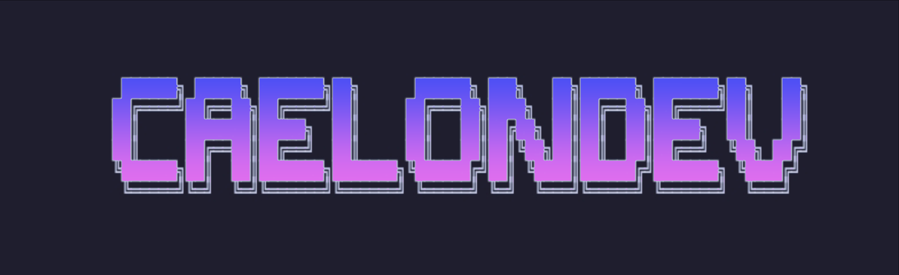

  

i'm caelon the cat :3

---

i like computers, they're the best!
i enjoy writing code closer to the machine. hoomans call it 'low-level', but i think they should rename it to 'hard-level' cuz it's not as easy as a low level in a game when handling memory urself ><

kidding aside, i'm jericho, and i'm unemployed. you should check https://caelondev.net/ if you want to know more about me.

---

here are my somewhat-cool projects

- [garrote](https://git.caelondev.net/caelondev/garrote) - a turing-complete queue-based esoteric language written in rust (because rust is *blazingly fast*™)

- [bf-rust](https://git.caelondev.net/caelondev/bf-rust) - a cool little brainfuck interpreter written in rust (again)

---

as you can see, i like rust a lot, though i'm keeping an eye on that explicit language ([zig](https://ziglang.org)). and so far, i'm liking it a lot

    
    
    
    

    

